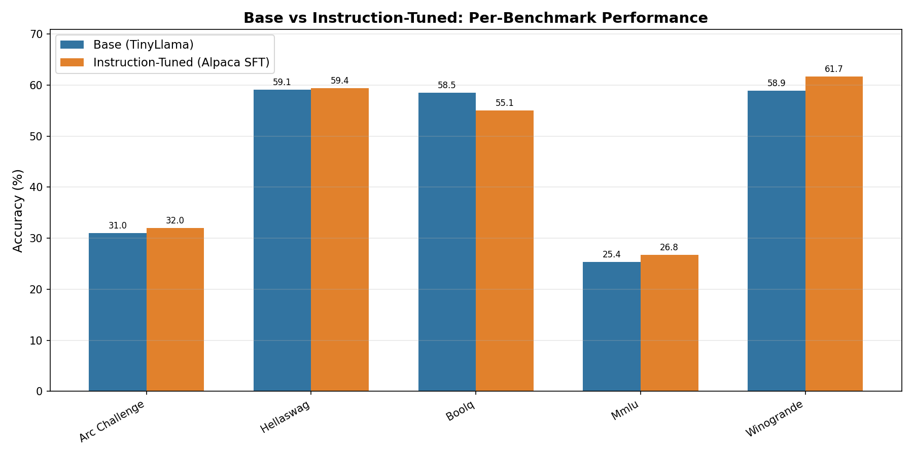
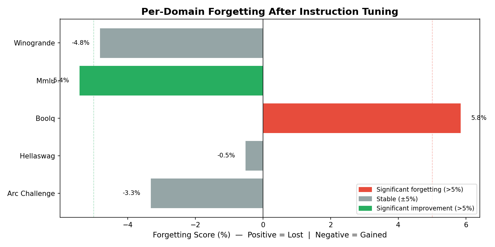
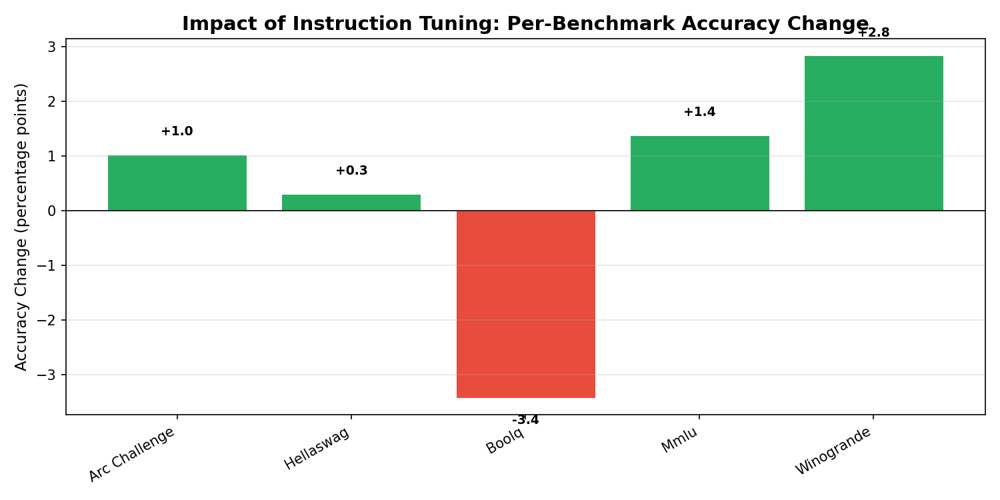

# Benchmarking Catastrophic Forgetting in TinyLlama After Instruction Tuning

Measures catastrophic forgetting caused by Self-Instruct style fine-tuning. Benchmarks TinyLlama 1.1B (base) against a LoRA-tuned version trained on Alpaca 52K, producing per-domain forgetting scores to determine whether forgetting is negligible, uniform, or domain-specific.

---

## Key Findings

| Task | Base | Instruct | Δ | Forgetting |
|---|---|---|---|---|
| ARC-Challenge | 30.97% | 32.00% | +1.03 | -3.32% ✦ |
| HellaSwag | 59.12% | 59.43% | +0.31 | -0.52% |
| BoolQ | 58.50% | 55.08% | -3.42 | **+5.85%** ⚠ |
| MMLU (avg) | 25.39% | 26.77% | +1.38 | -5.43% ✦ |
| WinoGrande | 58.88% | 61.72% | +2.84 | -4.82% ✦ |

> ⚠ significant forgetting (>5%) &nbsp;|&nbsp; ✦ significant improvement (>5%)

**Verdict: Domain-specific uneven forgetting (spread: 11.28%). Adaptive self-rehearsal has STRONG motivation.**

Forgetting is not uniform — BoolQ (reading comprehension / commonsense reasoning) degrades meaningfully while most other benchmarks hold or improve. This asymmetry is the core finding.

---

## Figures

### Base vs Instruction-Tuned Performance


### Per-Domain Forgetting Scores


### Accuracy Change Waterfall


---

## Setup

**Hardware:** NVIDIA RTX 4050 (6GB VRAM). LoRA is mandatory for fine-tuning on this GPU — full SFT will OOM.

```bash
pip install torch transformers accelerate datasets trl peft lm-eval rouge-score matplotlib pandas tabulate bitsandbytes
```

---

## Reproducing the Experiment

### 1. Benchmark the base model
```bash
mkdir -p results/base results/instruct

lm_eval --model hf \
    --model_args pretrained=TinyLlama/TinyLlama-1.1B-intermediate-step-1431k-3T,dtype=float16 \
    --tasks arc_challenge,hellaswag,boolq,mmlu,winogrande \
    --batch_size 1 \
    --output_path results/base/
```

### 2. Fine-tune on Alpaca 52K (LoRA)
```bash
python finetune.py
```
Uses LoRA (r=16, α=32) on `q/k/v/o_proj`. ~2–3 hours on RTX 4050, ~4GB VRAM.

### 3. Benchmark the fine-tuned model
```bash
lm_eval --model hf \
    --model_args pretrained=./tinyllama-alpaca-sft,dtype=float16 \
    --tasks arc_challenge,hellaswag,boolq,mmlu,winogrande \
    --batch_size 1 \
    --output_path results/instruct/
```

### 4. Compare and visualize
```bash
python compare.py     # prints forgetting table
python visualize.py   # saves figures to results/figures/
```

---

## Repository Structure

```
├── finetune.py                   # LoRA fine-tuning script
├── compare.py                    # Prints per-task forgetting table
├── visualize.py                  # Generates the three figures
├── merge.py                      # Merges LoRA adapter into base model
├── results/
│   ├── base/                     # lm-eval output for base model
│   ├── instruct/                 # lm-eval output for fine-tuned model
│   └── figures/                  # comparison.png, forgetting.png, delta_waterfall.png
└── tinyllama-alpaca-sft/         # Trained LoRA adapter weights
```

---

## Limitations

- **LoRA only:** Adapter fine-tuning underestimates forgetting compared to full SFT. The base model weights are frozen; only the adapter layers change. For stronger forgetting signal, rerun with full fine-tuning on a larger GPU (A100 / university cluster).
- **Single run:** No error bars. Benchmark variance on small models (especially MMLU at 25%) can be ±1–2%.
- **Alpaca 52K:** A single instruction dataset. Forgetting patterns may differ with other SFT mixtures.
